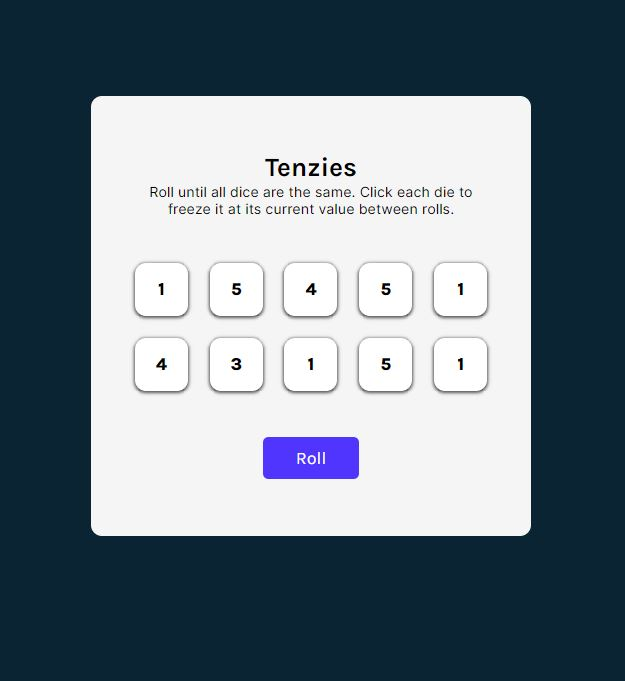
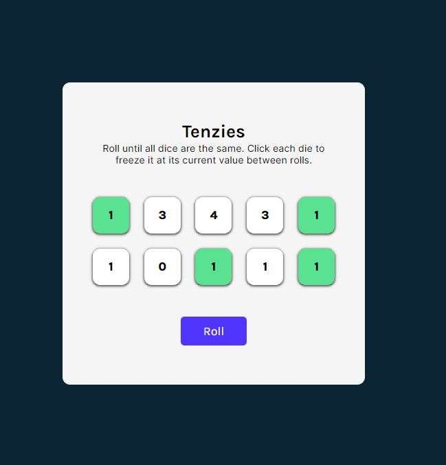
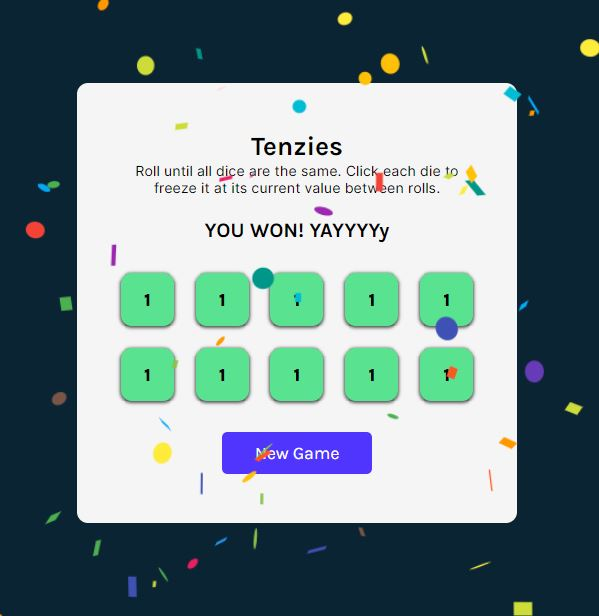

# TENZIES

A simple react app that simulates a game of tenzies.

This was a simple project to explore and understand how hooks in react perform and some of its cool features.

[Live](https://webdvprojects.github.io/tenzies-app/)

## How to play

- The goal of the game is to roll all 10 of your dice and have them all show the same number.

- Continue to roll and set aside matching dice until all 10 dice show the same number.

- Dice set aside will have a different color from the rest.

- You can also un-select a die that is already being held

## Preview

